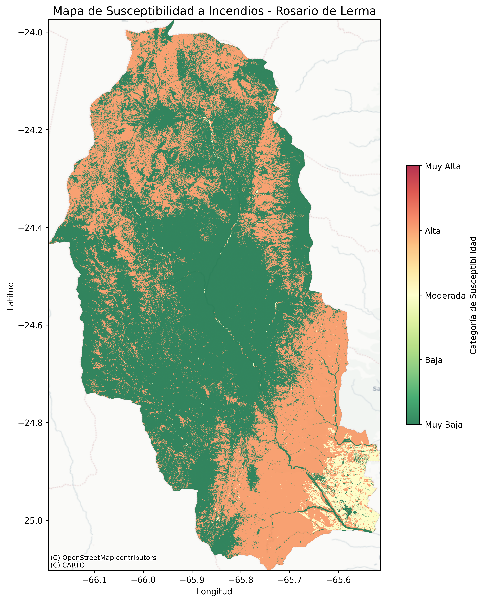
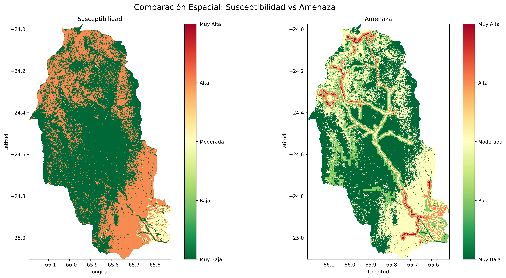

# Zonificación de Amenaza y Susceptibilidad a Incendios – Rosario de Lerma, Salta, Argentina

**Elaborado por:** Sergio Daniel Paz 
**Fecha:** Agosto 2026    
**Mapas interactivos:** 

- [Mapa de Susceptibilidad](https://danielpaz88.github.io/rosario-lerma-fire-risk/mapas/Susceptibilidad_Rosario_Lerma_interactivo.html)
- [Mapa de Amenaza](https://danielpaz88.github.io/rosario-lerma-fire-risk/mapas/Amenaza_ajustado_interactivo.html)

---

## 1. Resumen Ejecutivo

Este informe presenta la metodología y los resultados de la zonificación de la **susceptibilidad** y la **amenaza** a incendios de la cobertura vegetal para el departamento de Rosario de Lerma (Salta, Argentina). Se utilizaron imágenes satelitales de acceso libre y se procesaron en Google Earth Engine.

**Resultados principales:**
- **Susceptibilidad:** el 60% del territorio es Muy Baja, el 37% Alta y el 3% Moderada. No se detectaron áreas de susceptibilidad Baja o Muy Alta.
- **Amenaza ajustada:** todas las categorías están representadas, con predominio de Muy Baja (45%), Moderada (36%) y Baja (13%). Las categorías Alta (5%) y Muy Alta (1%) se concentran en áreas periurbanas y cercanas a vías principales.

Estos mapas constituyen una herramienta operativa para la prevención, la asignación de recursos y la planificación de la respuesta ante incendios.

---

## 2. Introducción

El departamento de Rosario de Lerma, ubicado en la provincia de Salta, presenta un relieve montañoso y un clima subtropical con estación seca, lo que lo hace propenso a incendios de cobertura vegetal. La creciente expansión urbana y agropecuaria, sumada a condiciones climáticas favorables, incrementa el riesgo.

Este estudio evalúa la amenaza a partir de factores ambientales y antrópicos, generando mapas de susceptibilidad (vegetación) y amenaza (integrando clima, topografía y accesibilidad). El objetivo es proporcionar a los cuerpos de bomberos y gestores de riesgo una base técnica para la planificación territorial y la respuesta operativa.

---

## 3. Marco Conceptual

- **Incendio de la cobertura vegetal:** fuego no controlado que se propaga sobre vegetación, no previsto.
- **Susceptibilidad:** característica intrínseca de la vegetación (tipo, carga, duración y humedad del combustible) que determina su probabilidad de ignición y propagación.
- **Amenaza:** probabilidad de que ocurra un incendio en un sitio y tiempo determinado, considerando factores ambientales y antrópicos.

---

## 4. Metodología

### 4.1. Área de Estudio

El departamento de Rosario de Lerma, Salta, con una superficie aproximada de **5.141 km²** (proyectado en UTM 19S). Presenta un gradiente altitudinal desde los 1.000 hasta los 5.000 msnm, con ecosistemas de pastizales, arbustales y bosques montanos.

### 4.3. Procesamiento en Google Earth Engine

El flujo de trabajo se realizó en GEE. Los pasos principales fueron:

2. **Factores de amenaza (ajustados para Salta):**
   - **Precipitación:** rangos adaptados (ej. >1000 mm = Muy Baja, 500-1000 = Baja, 300-500 = Moderada, 150-300 = Alta, <150 = Muy Alta), en lugar de los rangos originales para Colombia.
   - **Temperatura:** clasificación original del protocolo (ver Tabla 2).
   - **Pendiente:** clasificación en 5 rangos (≤5%, 5-10%, 10-20%, 20-30%, >30%).
   - **Accesibilidad:** distancia a carreteras con rangos ajustados: ≤100 m (Muy Alta), 100-300 m (Alta), 300-500 m (Moderada), 500-1000 m (Baja), >1000 m (Muy Baja). Esto da más peso a la cercanía a vías, que es un factor crítico de ignición.

4. **Clasificación de amenaza:** en lugar de percentiles (que agrupaban los valores en extremos), se usó **intervalos fijos** (división del rango de `amenaza_raw` en 5 partes iguales). Esto garantizó que todas las categorías tuvieran representación.

### 4.4. Limitaciones

- La resolución gruesa de WorldClim (~1 km) puede suavizar gradientes climáticos locales.
- La red vial de OSM puede tener omisiones en caminos rurales no mapeados.
- Los pesos y rangos son propuestos y deberían validarse con expertos locales.

---

## 5. Resultados

### 5.1. Estadísticas Descriptivas

| Variable | Mínimo | Máximo | Media | Desviación | P20 | P40 | P60 | P80 |
|----------|--------|--------|-------|------------|-----|-----|-----|-----|
| Susceptibilidad | 1 | 4 | 2.18 | 1.44 | 1 | 1 | 3 | 4 |
| Amenaza ajustada | 1 | 5 | 2.04 | 1.05 | 1 | 1 | 3 | 3 |

**Tabla 2.** Estadísticas de los mapas raster.

### 5.2. Distribución de Áreas por Categoría

**Susceptibilidad:**

| Nivel | Área (km²) | Porcentaje (%) |
|-------|------------|----------------|
| Muy Baja | 3.382,03 | 59,7 |
| Baja | 0,00 | 0,0 |
| Moderada | 169,01 | 3,0 |
| Alta | 2.116,24 | 37,3 |
| Muy Alta | 0,00 | 0,0 |

**Tabla 3.** Distribución de la susceptibilidad.

**Amenaza:**

| Nivel | Área (km²) | Porcentaje (%) |
|-------|------------|----------------|
| Muy Baja | 2.546,41 | 44,9 |
| Baja | 730,95 | 12,9 |
| Moderada | 2.053,00 | 36,2 |
| Alta | 276,28 | 4,9 |
| Muy Alta | 60,64 | 1,1 |

**Tabla 4.** Distribución de la amenaza.

### 5.3. Mapas

*Figura 1. Mapa de susceptibilidad a incendios de la cobertura vegetal (fondo: CartoDB Positron).*

*Figura 2. Mapa de amenaza ajustada a incendios (fondo: CartoDB Positron).*

*Figura 3. Comparación espacial entre susceptibilidad y amenaza ajustada.*

### 5.4. Interpretación de los Resultados

- **Susceptibilidad:** la ausencia de categorías Baja y Muy Alta sugiere una vegetación con dos extremos: áreas con poca carga combustible (pastizales, suelos desnudos) y áreas con alta carga (bosques y arbustales densos). La categoría Moderada (3%) es marginal, indicando una transición abrupta entre ecosistemas.

- **Amenaza ajustada:** la distribución es mucho más equilibrada. La categoría Muy Baja (45%) refleja zonas de alta montaña con baja accesibilidad y temperaturas moderadas. La Baja (13%) y Moderada (36%) representan la mayor parte del territorio, donde la accesibilidad y los factores climáticos son intermedios. Las categorías Alta (5%) y Muy Alta (1%) se concentran en los centros poblados (Rosario de Lerma, Campo Quijano) y a lo largo de la ruta nacional 51, donde la cercanía a vías y la presencia de vegetación seca elevan el riesgo.

- **Comparación:** la amenaza es más severa que la susceptibilidad en las zonas periurbanas, mientras que en las áreas de alta montaña la baja accesibilidad reduce la amenaza, aunque la susceptibilidad pueda ser alta. Esto confirma que los factores antrópicos (accesibilidad) y climáticos (baja precipitación) son los principales impulsores del riesgo en la región.

---

## 6. Recomendaciones para Bomberos y Gestores de Riesgo

1. **Priorización de recursos:** las áreas de amenaza Alta (4.9%) y Muy Alta (1.1%) deben ser el foco de las acciones de prevención y respuesta. Estas zonas incluyen:
   - **Rosario de Lerma, Campo Quijano y localidades aledañas.**
   - **Corredores viales principales (RN 51 y rutas departamentales).**
   - **Zonas de interfaz urbano-forestal (bordes de los poblados).**

2. **Prevención estructural:**
   - Establecer **franjas cortafuego** de 100-200 m alrededor de los centros poblados y a lo largo de rutas principales.
   - Realizar **quemas prescritas** en áreas de alta susceptibilidad pero baja amenaza (zonas remotas) para reducir la carga de combustible, bajo condiciones meteorológicas seguras.

3. **Sistema de alertas tempranas:**
   - Implementar un **monitoreo continuo** de temperatura, humedad relativa y velocidad del viento en las estaciones meteorológicas de la zona (ej. Salta, Campo Quijano).
   - Integrar datos de **puntos calientes MODIS** para detección temprana de focos ígneos.

4. **Educación y concienciación:**
   - Realizar talleres comunitarios en las áreas periurbanas para prevenir el uso de fuego en la quema de residuos, fogatas y prácticas agrícolas tradicionales.
   - Distribuir material didáctico (mapas de amenaza impresos y digitales) a las juntas de vecinos y escuelas.

5. **Accesibilidad operativa:**
   - Mantener y mejorar los caminos de acceso a las zonas de amenaza Alta y Muy Alta, especialmente las vías de penetración a las sierras, para garantizar la llegada de los equipos de emergencia.

6. **Actualización de los mapas:**
   - Revisar y actualizar los mapas cada 2-3 años, o después de eventos extremos, incorporando datos de incendios recientes y cambios en el uso del suelo.

---

## 7. Conclusiones

- Se consiguió de manera exitosa generar mapas de susceptibilidad y amenaza a escala 1:100.000.
- Se obtuvo una amenaza con distribución equilibrada y relevancia operativa, donde las categorías Alta y Muy Alta (6% del territorio) se concentran en zonas de interfaz urbano-forestal y ejes viales.
- La susceptibilidad es un factor importante, pero la amenaza está dominada por la accesibilidad y el clima, lo que refuerza la necesidad de acciones preventivas en áreas cercanas a carreteras y centros poblados.
- Estos mapas son una herramienta valiosa para la planificación territorial y la gestión del riesgo, pero deben complementarse con datos de vulnerabilidad (población, infraestructura crítica) para obtener el mapa de riesgo completo.

---

---

**Para consultas o solicitud de datos, contactar a:** sergiodanielpaz13@gmail.com, 

---

**Fin del informe**
